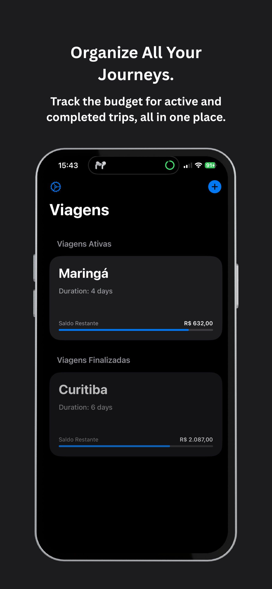
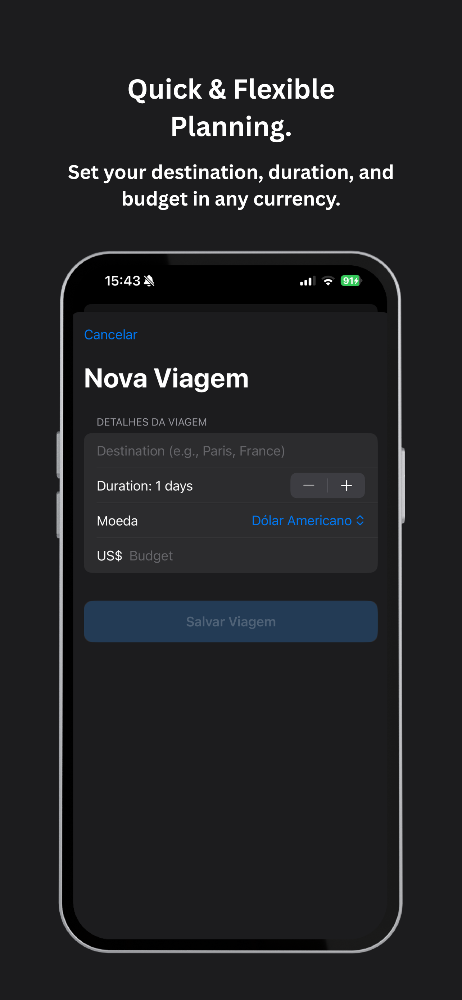
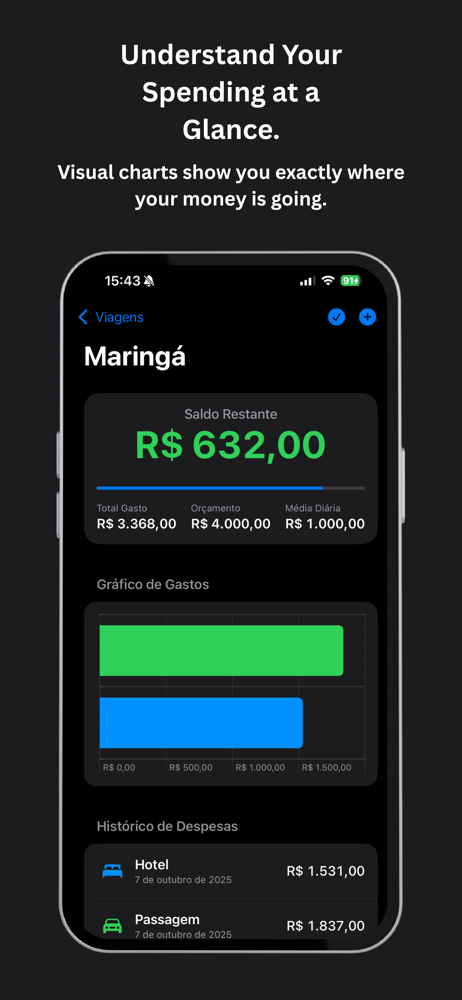

<p align="center">
  
</p>

<h1 align="center">VogaTrip</h1>

<p align="center">
  Trip budget tracker for iPhone and iPad.
</p>

<p align="center">
  
</p>

<p align="center">
  <a href="https://apps.apple.com/us/app/vogatrip/id6753733983">
    
  </a>
</p>

<p align="center">
  
  
  
</p>

## Features

- Create a trip with a destination, date range, budget, and currency (USD, BRL, EUR, GBP)
- Log expenses as accommodation, food, transport, or leisure
- See remaining balance, total spent, total budget, daily average, and a progress bar
- Bar chart of spending by category
- Keep active and completed trips; edit dates and budget on an open trip
- Mark a trip complete, then export its expenses as a CSV through the system share sheet
- English and Brazilian Portuguese
- Trip list syncs with iCloud key-value storage

## Tech

Swift, SwiftUI, Swift Charts, and Combine. The trip list is JSON in `NSUbiquitousKeyValueStore`. The language choice stays in `UserDefaults`. The CSV share sheet uses `UIActivityViewController`.

## Architecture

`VogaApp` shows a splash screen, then `ContentView`, and injects `LanguageSettings` into the environment. Screens live in `Voga/Views`, trip and expense types in `Voga/Models/Trip.swift`, and writes go through `TripViewModel`. Saving the list encodes `[Trip]` to the iCloud key `savedTripsList_iCloud`. An external iCloud change reloads that list. `CurrencyFormatter` parses amounts with the device locale.

## Privacy

No tracking, no analytics, and no account with the developer. Trip data stays in your iCloud key-value store. The language setting stays on the device. [Privacy policy](https://vogapp.gabrieldazzi.com).

## Requirements

iOS 16.6 or later, iPhone and iPad. Xcode 26.

```bash
open Voga.xcodeproj
```

Signing is automatic. If it fails, pick your own team. The target needs the iCloud key-value storage capability (`Voga/Voga.entitlements`). Bundle ID is `com.gabrieldazzi.Voga`.

## Author

Gabriel Bonomo Dazzi

- [gabrieldazzi.com](https://gabrieldazzi.com)
- [GitHub](https://github.com/GabrielDazzi)

## License

[MIT](LICENSE)
